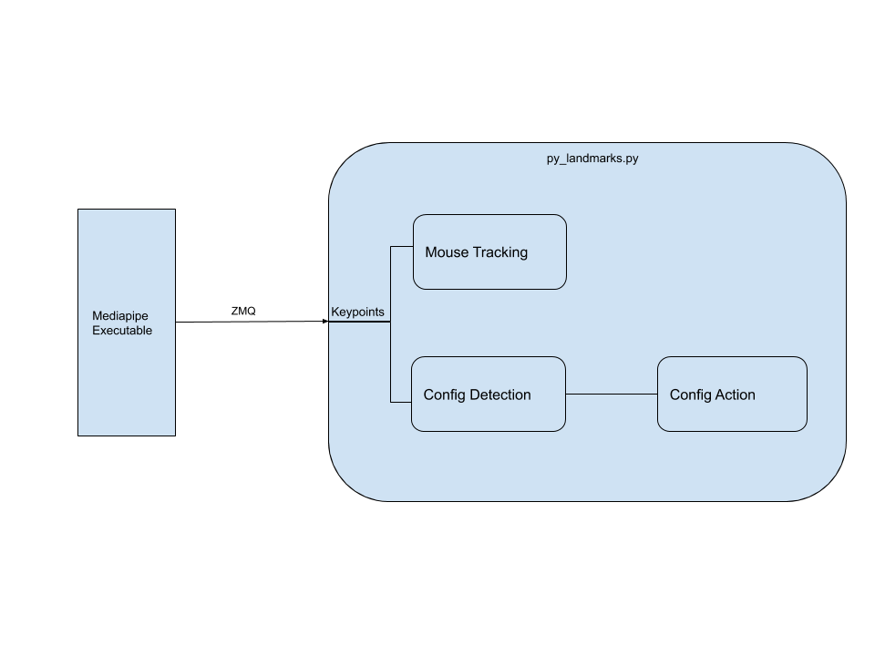

# gestures-mediapipe


Built on top of [mediapipe](https://github.com/google/mediapipe), this repo aims to be a tool to navigate a computer through hand gestures. The hand keypoints are detected using google's mediapipe. These keypoints are then fed into a Python script through [ZeroMQ](https://zeromq.org) and [protobuf](https://developers.google.com/protocol-buffers) for further use. 

The keypoint of the tip of the index finger is extracted in the Python script, and, through pyautogui, used to control the mouse. A neural network trained on the included dataset classifies gestures and actions are performed based on this classification.

For more advanced gestures, the concept of **modes** is utilized. You can switch from the *mouse* mode to the *gesture* mode for gestures to control audio, brightness etc. [Work in progress]

The code consists of a few distinct pieces which are:

* The mediapipe executable - A modified version of the hand tracking example given in mediapipe, this executable tracks the keypoints, stores them in a protobuf, and transmits them using ZMQ.
* Mouse tracking - Part of `gesture_control.py`, responsible for moving the cursor using the position of the index finger.
* Config detection - Takes in the keypoints from the mediapipe executable, and converts them into a high level description of the state of the hand.
* Config action - Uses the configuration from the previous module, and executes an action depending on various factors, i.e. current and previous states of the hand, whether such an action is permissible in the given context etc.

### [Demo video link](https://drive.google.com/file/d/1UmL5u6LCbpAZFdJM46QpT9r7uGjbP4Mz/view)


A visualization of the various modules : 



### Gestures

*Note*: 
* In **mouse** mode, the mouse is tracked simply by moving the index finger. 
* Mode Switch is a work in progress.
* A left click can be performed by performing the mouse down and gesture and immediately returning to the open hand gesture to register a single left mouse button click.


| Gesture name   | Gesture Action   | Image                               |
| -------------- | ---------------- | --------------------------------    |
| seven          | Left Mouse Down  |          |
| eight          | Double Click     |          |
| four           | Right Mouse Down |            |
| spiderman      | Scroll           |  |
| hitchhike      | Mode Switch      |  |

### Requirements

As well as mediapipe's own requirements, there a few other things required for this project.

* ZeroMQ (along with cppzmq and pyzmq)

The zeromq library (*libzmq.so*) must be symlinked into this directory. The header only C++ binding **cppzmq** must also be installed and its header (*zmq.hpp*) symlinked into the working directory. The python module **pyzmq** must also be installed for python to read the keypoints being sent.

* protobuf (Python)

The protobuf module in Python must be installed, through the use of `pip` or your distribution's package manager.

* pyautogui

pyautogui is a GUI automation python module used, in this case, to simulate the movement of the mouse. As with other python packages, to be installed through `pip` or package manager e.g. `apt`. 

* Pytorch

Used to train and deploy the neural net which recognizes gestures.

### Usage

1. Clone mediapipe and set it up. Make sure the provided hand tracking example is working.
2. Clone this repo in the top level directory of mediapipe. Install all dependencies.
3. Run the instructions below to build and then execute the code. 

Note: Run build instructions in the `mediapipe/` directory, not inside this directory.

#### Mediapipe Executable

##### GPU (Linux only)
``` sh
bazel build -c opt --verbose_failures --copt -DMESA_EGL_NO_X11_HEADERS --copt -DEGL_NO_X11 gestures-mediapipe:hand_tracking_gpu

GLOG_logtostderr=1 bazel-bin/gestures-mediapipe/hand_tracking_gpu --calculator_graph_config_file=gestures-mediapipe/hand_tracking_desktop_live.pbtxt

```

##### CPU
``` sh
bazel build -c opt --define MEDIAPIPE_DISABLE_GPU=1 gestures-mediapipe:hand_tracking_cpu

GLOG_logtostderr=1 bazel-bin/gestures-mediapipe/hand_tracking_cpu --calculator_graph_config_file=gestures-mediapipe/hand_tracking_desktop_live.pbtxt

```

#### Python Script

``` python
python gestures-mediapipe/gesture_control.py

```

### Repo Overview

* models -> Stores the trained model(s) which can be called by other files for inference
* proto -> Holds the definitions of the protobufs used in the project for data transfer
* BUILD -> Various build instructions for Bazel
* `static_data_collection.py` -> Script to create static gesture dataset 
* `data/gestures_mapping.json` -> Stores the encoding of the gestures as integers
* `data/static_gestures_data.csv` -> Dataset created with data_collection.py 
* `hand_tracking_desktop_live.pbtxt` -> Definition of the mediapipe calculators being used. Check out mediaipe for more details.
* `hand_tracking_landmarks.cc` -> Source code for the mediapipe executable. GPU version is Linux only.
* `model.py` -> Declaration of the model(s) used.
* `train_model.py` -> Trains the "GestureNet" model for static gestures and saves to disk
* `dynamic_train_model.py` -> Transforms and loads data from the SHREC dataset, trains a neural network and saves to disk. 
* `gesture_control.py` -> Heart of the project, code to interface with the system using gestures.


### Useful Information

[Joints of the hand](https://en.wikipedia.org/wiki/Interphalangeal_joints_of_the_hand)

[HandCommander](https://www.deuxexsilicon.com/handcommander/)

[Video recorded with VokoScreenNG](https://github.com/vkohaupt/vokoscreenNG)
