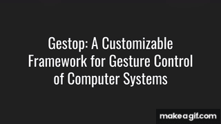

# Gestop : Customizable Gesture Control of Computer Systems

This is the implementation of the approach described in the paper:
> Sriram Krishna and Nishant Sinha. [Gestop: Customizable Gesture Control of Computer Systems](https://arxiv.org/abs/2010.13197) 8th ACM IKDD CODS and 26th COMAD. 2021. 405-409.

Built on top of [mediapipe](https://github.com/google/mediapipe), this project aims to be a tool to interact with a computer through hand gestures. Out of the box, using this tool, it is possible to:

1. Use your hand to act as a replacement for the mouse.
2. Perform hand gestures to control system parameters like screen brightness, volume etc.

In addition, it is possible to extend and customize the functionality of the application in numerous ways:

1. Remap existing hand gestures to different functions in order to better suit your needs.
2. Create custom functionality through the use of either python functions or shell scripts.
3. Collect data and create your own custom gestures to use with existing gestures. 

### Demo (Click on the image to see the full video)
[](https://www.youtube.com/watch?v=K2UkIjK7BTI)

### [Static and Dynamic Gestures Dataset link](https://drive.google.com/drive/folders/1zMFQVKvpAhU-EKGxQNyFXKTu1TgBH23L?usp=sharing)

### Installation

Installation using `pip` inside a virtual environment is highly recommended. To do so:

``` python
python -m venv env
source env/bin/activate
pip install gestop
```

In addition to the Python dependencies, [OpenCV](https://opencv.org/) and [xdotool](https://github.com/jordansissel/xdotool) are also required by Gestop.

### Usage

#### Server

To start the **Gestop** server:

``` python
python -m gestop.receiver
```

#### Client

The client, or the *keypoint generator*, can be setup either through MediaPipe's C++ API, or through its Python API. The Python API is simpler to setup and is recommended.

#### MediaPipe Python API

``` python
python -m gestop.keypoint_gen.hand_tracking
```

##### MediaPipe C++ API

1. Download mediapipe and set it up. MediaPipe >=0.8.0 is **NOT** supported and should no be used. Make sure the provided hand tracking example is working to verify if all dependencies are installed.
2. Clone this repo in the top level directory of mediapipe. Install all of Gestop's dependencies.
3. Run the instructions below to build and then execute the code. 

*Note:* Run build instructions in the `mediapipe/` directory, not inside this directory.

###### GPU (Linux only)
``` sh
bazel build -c opt --verbose_failures --copt -DMESA_EGL_NO_X11_HEADERS --copt -DEGL_NO_X11 gestop:hand_tracking_gpu

GLOG_logtostderr=1 bazel-bin/gestop/hand_tracking_gpu --calculator_graph_config_file=gestop/gestop/keypoint_gen/hand_tracking_desktop_live.pbtxt
```

###### CPU
``` sh
bazel build -c opt --define MEDIAPIPE_DISABLE_GPU=1 gestop:hand_tracking_cpu

GLOG_logtostderr=1 bazel-bin/gestop/hand_tracking_cpu --calculator_graph_config_file=gestop/keypoint_gen/hand_tracking_desktop_live.pbtxt
```

### Overview

The hand keypoints are detected using google's MediaPipe. These keypoints are then fed into `receiver.py` . The tool recognizes two kinds of gestures:

1. Static Gestures : Gestures whose meaning can be inferred from a single image itself.
2. Dynamic Gestures : Gestures which can only be understood through a sequence of images i.e. a video.

Static gestures, by default, are mapped to all functionality relevant to the mouse, such as left mouse click, scroll etc. Combined with mouse tracking, this allows one to replace the mouse entirely. The mouse is tracked simply by moving the hand, where the tip of the index finger reflects the position of the cursor. The gestures related to the mouse actions are detailed below. To train the neural network to recognize static gestures, a dataset was created manually for the available gestures.

For more complicated gestures involving the movement of the hand, dynamic gestures can be used. By default, it consists of various other actions to interface with the system, such as modifying screen brightness, switching workspaces, taking screenshots etc. The data for these dynamic gestures comes from [SHREC2017 dataset](http://www-rech.telecom-lille.fr/shrec2017-hand/). Dynamic gestures are detected by holding down the `Ctrl` key, which freezes the cursor, performing the gesture, and then releasing the key.

The project consists of a few distinct pieces which are:

* MediaPipe - Accessed through either the Python API or the C++ API, MediaPipe tracks the hand, generates the keypoints and transmits them.
* Gesture Receiver - See `receiver.py`, responsible for handling the stream and utilizing the following modules.
* Mouse Tracker - See `mouse_tracker.py`, responsible for moving the cursor using the position of the index finger.
* Gesture Recognizer - See `recognizer.py`, takes in the keypoints from the mediapipe executable, and converts them into a high level description of the state of the hand, i.e. a gesture name.
* Gesture Executor - See `executor.py`, uses the gesture name from the previous module, and executes an action.

### Notes

* For best performance, perform dynamic gestures with right hand only, as all data from SHREC is right hand only.
* For dynamic gestures to work properly, you may need to change the keycodes being used in `executor.py`. Use the given `find_keycode.py` script to find the keycodes of the keys used to change screen brightness and volumee. Finally, system shortcuts may need to be remapped so that the shortcuts work even with the Ctrl key held down. For example, in addition to the usual default behaviour of `<Prnt_Screen>` taking a screenshot, you may need to add `<Ctrl+Prnt_Screen>` as a shortcut as well. 

### [Customizing Gestop](CUSTOMIZATION.md)

### [Available Gestures](GESTURES.md)

### [API Reference](API_REFERENCE.md)

### Useful Information

[Joints of the hand](https://en.wikipedia.org/wiki/Interphalangeal_joints_of_the_hand)

[HandCommander](https://www.deuxexsilicon.com/handcommander/)

[Video recorded with VokoScreenNG](https://github.com/vkohaupt/vokoscreenNG)
